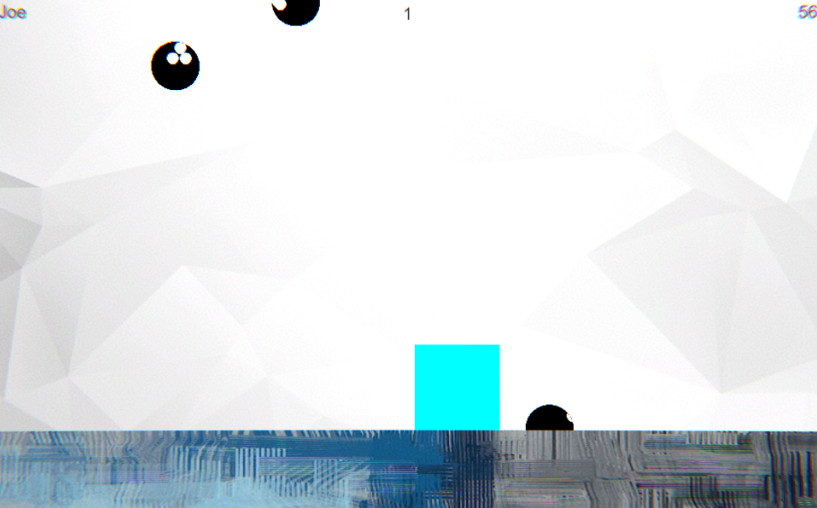

# 02CandyCatcher-NicoB

## Finished project:
https://5ahmnm2122.github.io/02CandyCatcher-NicoB/

### Project description: 
- Enter name in first scene
- Play main level, move with "a" or "d" / mouse, red candies are good, black ones bad
- See your score in the last level and eventually restart game

### Development platform: 
OS: Windows 11, Game Engine: Unity 2020.3.18f1, Visual Studio 2019

## Software/Hardware Requirements: 
WebGL has to be enabled/installed

### Target platform: 
WebGL

### Visuals: 

### Third party material: 
- Background: https://cdn.wallpapersafari.com/90/7/KGe7I0.jpg
- Floor: https://i.pinimg.com/736x/4d/2c/19/4d2c1913140456e53f1938b2d35b40cf.jpg

### Project state: 
100%/100% finished
<progress max="100" value="100"></progress>

### Limitations: 
none

### Lessons Learned: 
none

Copyright by Nico-B
Template by smers